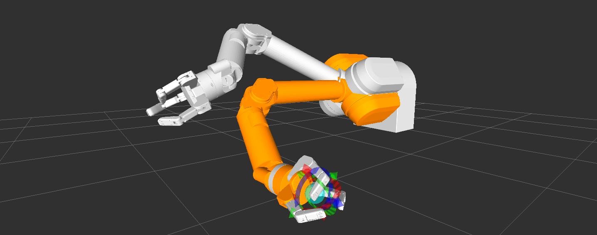

# WAM / BHand MoveIt! Config



## Xacro-Based SRDF

Generate an SRDF on the command-line like so:

```sh
cd barrett_wam_moveit_config/config
rosrun xacro xacro.py -o wam7_hand.srdf wam7.srdf.xacro prefix:=wam hand:=true ball:=false empty:=false
```

